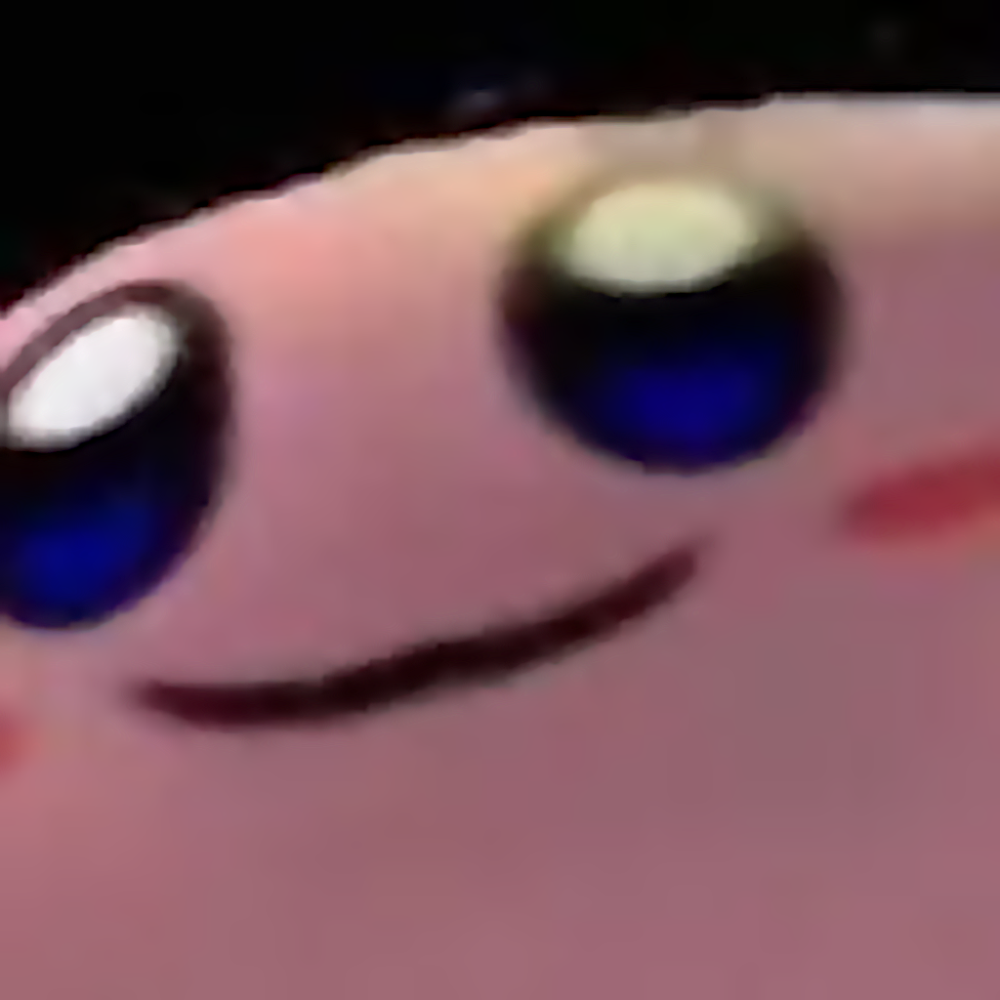

# WopBot
**WopBot** is a discord bot that lets you take care of your very own virtual pet. Feed your pet, train it, and take your place on the pet leaderboard!

Get started by [buying a pet](#buying-a-pet)

# Contents
- [WopBot](#wopbot)
- [Contents](#contents)
- [List of Commands](#list-of-commands)
- [Pets](#pets)
  - [Buying a Pet](#buying-a-pet)
  - [Pet Type and Rarity](#pet-type-and-rarity)
  - [Status](#status)
    - [XP and Levels](#xp-and-levels)
    - [Status Effects](#status-effects)
    - [Trophies](#trophies)
    - [Leaderboard Icon](#leaderboard-icon)
  - [Actions](#actions)
- [Inventory & Shop](#inventory--shop)
  - [Shopping](#shopping)
- [Inventory & Banking](#inventory--banking)
- [Events](#events)
  - [Betting](#betting)
  - [Races](#races)
  - [Brawls](#brawls)
- [Leaderboard](#leaderboard)
- [Credits](#credits)

# List of Commands
Below is a list of all commands you can use with WopBot:  
(You can view this list at any time by using `p.help`)

- **Util**  
  - `p.ping` - Check if the bot is alive
  - `p.help` - List all the available commands, or get help for a particular command
- **Pet**
  - `p.pet` - View your pet
  - `p.feed` - Feed your pet
  - `p.play` - Play with your pet
  - `p.train` - Train your pet to increase its stats
  - `p.release` - Release your pet to the wild :'(
- **Money**
  - `p.balance` - Check your current balance
  - `p.deposit` - Deposit money into your bank account
  - `p.withdraw` - Withdraw money from your bank account
  - `p.transfer` - Transfer money to someone else
  - `p.work` - Earn some cash by working
- **Shop**
  - `p.inventory` - View your inventory
  - `p.browse` - View items in the shop
  - `p.buy` - Buy items from the shop
- **Fun**
  - `p.park` - Bring your pet to the park
  - `p.slots` - Play the slot machine  
- **Events**
  - `p.race` - Commands related to races
  - `p.brawl` - Commands related to brawls
  - `p.bet` - Bet on someone's pet 
 
# Pets

## Buying a Pet
WopBot is all about pets. You can get your first pet by buying a pet capsule. You can see what pet capsules are available by using `p.browse`; you can buy pet capsules with the `p.buy <item>` command. ([Read more about the shop](#shopping))

There are 3 types of pet capsules, with different chances of common, uncommon, and rare pets. You can buy the following pet capsules:

💊 **Basic Pet Capsule** - ₩200  
80% common, 15% uncommon, 5% rare

🌟 **Advanced Pet Capsule** - ₩500  
60% common, 30% uncommon, 10% rare

🌠 **Magical Pet Capsule** - ₩1000  
60% uncommon, 40% rare

## Pet Type and Rarity
There are 3 different rarities of pets: **Common**, **Uncommon**, and **Rare**. When you buy a pet, it will be one of these rarities. Pet rarities have slightly higher starting speed, stamina, and strength stats. Otherwise, rarity is purely cosmetic :)

## Status
Every pet has 6 stats, plus an energy bar. Here are what each of them mean:

**Health ❤️**  
Your pet's health starts at 100%. If your pet's health drops to 0, it will die! You can keep it from dying by feeding and playing with it.

**Hunger 🍗**  
Your pet's hunger starts at 0% and grows over time. Feed your pet to keep your pet's hunger low. If your pet gets too hungry, it may start to lose health and eventually starve.

**Happiness 😃**  
How happy your pet currently is. Your pet will slowly get bored and become unhappy over time. Play with your pet to keep it happy. If your pet gets too unhappy, it may lose health and die.

**Strength 💪, Speed 💨, and Stamina 🦴**  
These stats start anywhere between 0-30, depending on your pet's rarity type. You can increase these stats by training it. Strength, Speed, and Stamina will affect how well your pet does in events like [races](#races) and [brawls](#brawls).

### XP and Levels
Your pet can earn XP by doing activities like feeding, playing, and visiting the park. However, your pet will earn much more XP by participating in events like races and brawls!

Once your pet has enough XP, it will level up to the next level. The pets with the highest XP levels will be highest up on the leaderboard!

### Status Effects
On your pet, you may see symbols like (🍜 7.5hr) or (🥬 46hr). These are status effects, most commonly caused by eating a special food. Each status effect will take effect until the time runs out.

### Trophies
On your pet, any trophies won from races/brawls will be displayed. For example, if you got 2nd place in a race *and* won 2 brawls, your pet may have these icons: 🏁(🥈) 🥊(🏅🏅)

### Leaderboard Icon
The top 3 pets will have a special medal displayed on their profile. This is also visible on the [leaderboard](#leaderboard)

## Actions
**Feed 🍗**  
Feeding your pet is one of the most important things you must do to keep it alive and healthy. There are different types of pets you can feed your pet - see the [shop](#shopping) for items that you can feed it.

All normal foods will set your pet's hunger back to 0. Some foods are healthier and may boost your pet's health. Other foods are unhealthier - your pet can occasionally gain happiness from eating them, but they can also lose some health as well.

Some foods are special and will not reduce your pet's hunger. They instead have a variety of special and/or magical effects, that vary based on the type of food. Check the description of the food in the shop to see what effects they have.

Use `p.feed` to feed your pet, or use `p.feed <food>` to feed a specific type of food. You may have to buy food using the `p.buy` command first. Feeding takes 2 energy for normal foods.

**Play ⚽️**  
You can play with your pet to increase it's happiness.

Use `p.play` to play with your pet. Playing with your pet takes 3 energy.

**Train 🏋️**  
Train your pet to build up it's strength, speed, and stamina levels. There are 5 different types of training that you can do, and each one will increase your pet's strength, speed, and/or stamina. Try to figure out which ones are which!

Training types: **hurdles**, **fight**, **jog**, **swim**, **walk**

You can train by using `p.train <training_type>`.

**Park 🏞️**  
You can bring your pet to the park, where it will stay to play for 2 hours. During this time, every pet at the park will earn some XP, depending on the number of pets simultaneously at the park. The more pets there are at the park, the more XP every pet will earn!

# Inventory & Shop

## Shopping
You can buy various things from the shop. Use the `p.browse` command to see what the shop offers. Once you have an item you would like to purchase, you can use `p.buy <item>`, with the name of the item you would like to purchase. For example, if you would like to buy a Basic Pet Capsule, you would use `p.buy basic pet capsule`. Capitalization does not matter, and some aliases are accepted like `p.buy kale` for Super Kale.

You can buy things like:
- Foods, used to feed your pet. Some are healthier than others.
- Special foods with special effects
- Pet capsules, that increase the chance of getting an uncommon or rare pet
Use `p.browse` to see the full list of items.

# Inventory & Banking
Use the `p.inventory` command to view what items you have.

Use the `p.balance` command to view your wopbucks balance.

You can deposit money into the bank using the `p.deposit` and `p.withdraw` commands respectively. While in the bank, you will earn 5% interest every 12 hours. However, any withdrawings or deposits will be deducted by a 10% transfer fee! Make sure you transfer your money wisely

# Events
Events are an exciting way to interact with other people's pets. Plus, they're a great way to earn XP!

## Betting
You can place bets on different players' pets for both races and brawls. You can bet on any participants in a race, as well as either pet in a brawl. You can place a bet using the `p.bet` command.

Payouts are payed out evenly based on how much was bet. So, for example, if one person bets twice as much as another person for a single pet, the first player will earn twice as much payout as the second person.

## Races
Races are exciting individual pet competitions, where the fastest pets will triumph. Having a high speed and/or stamina stats will help.

Create a race that others can join by using the `p.race create` command. They can then join using the `p.race join` command. During this time, people can also bet on races.

Once enough people have joined, the creator of the race can use the `p.race start` command to start the race. There must be between 3-8 participants to start a race.

Winning pets will earn both money prizes and XP bonuses. The more participants there are, the more prizes there will be, so it is recommended to have at least 5 participants in a race for maximum prize payout.

## Brawls
Brawls are fierce head-to-head competitions between two pets, where the strongest one will reign champion. Pets will take turns slashing at each other's health. Warning: if one pet is too strong over another pet, there is a possible chance for that pet to die! This competition is not for the weak of heart.

Challenge someone to a brawl using the `p.brawl challenge` command. They can either accept with `p.brawl accept` or decline with `p.brawl decline`. At any point, people may place bets.

Once the opponent has accepted, the challenger may use `p.brawl start` to start the battle. The pet who is victorious will win large amounts of XP and money.

# Leaderboard
There is a global pet leaderboard, which you can see in the `#leaderboard` channel. It updates approximately every 30 minutes.

The top 3 pets on the leaderboard will have a special icon beside their name, a medal with either a (1), (2), or (3). These icons are also visible beside the pet's name.

# Credits
WopBot was coded by **MrSiliconGuy**

Pet images and other assets were made by **MopWop** and **kcmdjidk**

Additional testing by **Jane**, **Zebastian1**, and **Stabletables**
